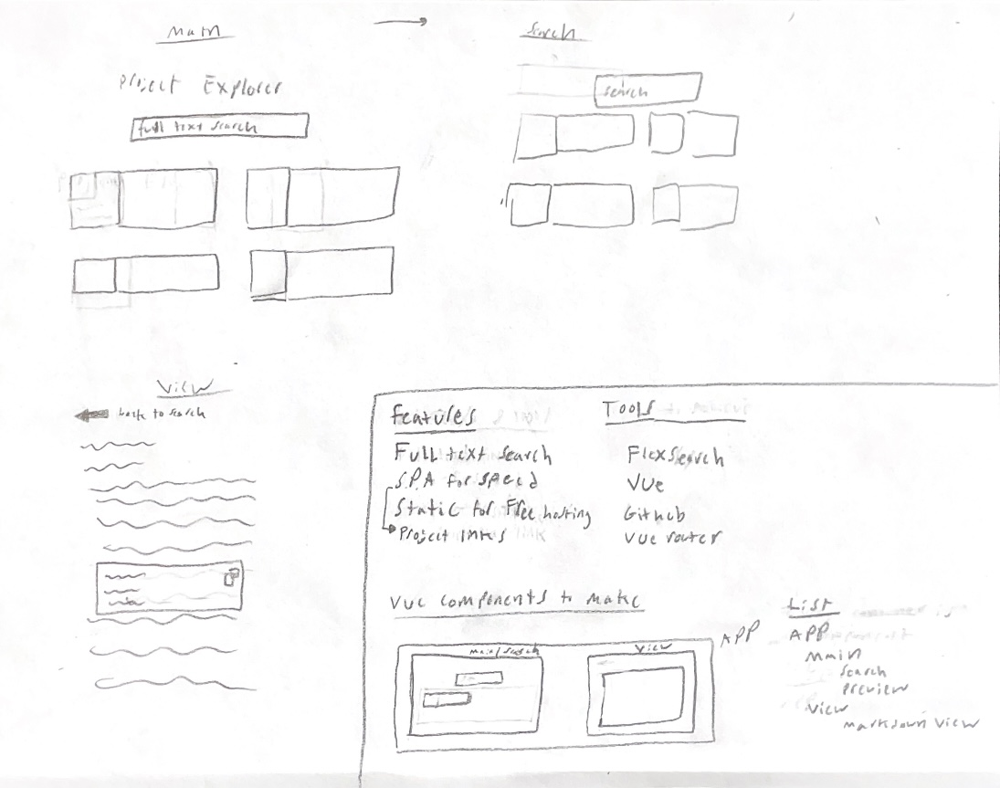

# Blog
How it was made

## Steps
1. Creation - created rough sketch the what I wanted the blog to look like
2. Barinstorming - listed all the features I wanted then how to accomplish them
3. Refinement - didn't end up taking anything out
4. Action   - started coding

Heres what it looked like

    

